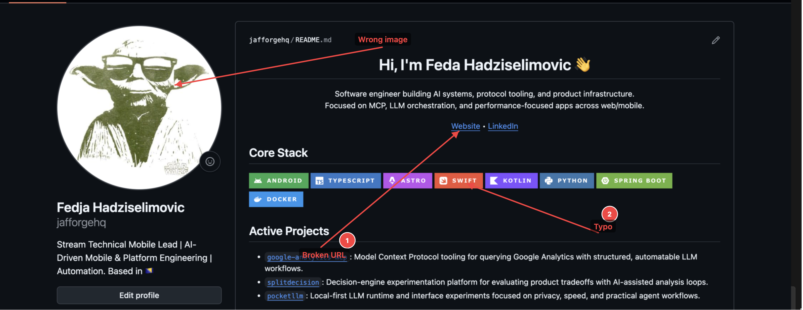
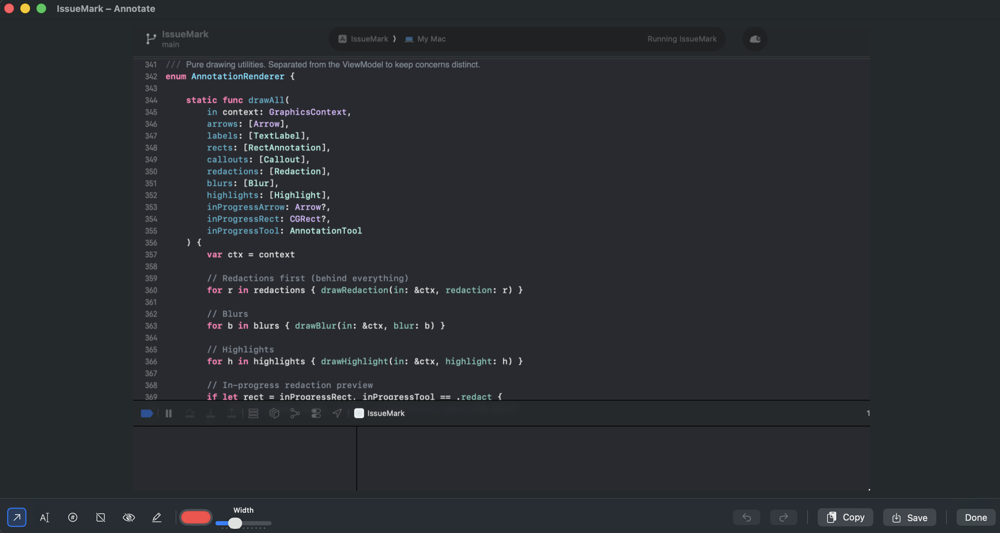

# IssueMark

> A sleek, efficient **macOS menu-bar tool** for taking screenshots and annotating them with arrows, text labels, rectangles, numbered callouts, blur, and redactions—all without leaving your workflow.

**🆓 Fully Open Source · MIT License · Free to use, modify, and distribute**



## ✨ Features

- **Quick Screenshot Capture**: Select any region from the menu bar
- **Powerful Annotation Tools**:
  - **Arrows** with intelligent label positioning (perpendicular to shaft)
  - **Text Labels** with dark backgrounds for readability
  - **Rectangles** for highlighting regions
  - **Numbered Callouts** for step-by-step guides
  - **Redactions** for privacy (solid black fill, non-reversible)
  - **Blur** for sensitive information
  - **Highlight/Marker** for emphasis
- **Keyboard Shortcuts**: Press 1–6 to switch tools instantly
- **Live Preview**: See annotations update in real-time
- **Tool Persistence**: Your last-selected tool is remembered
- **Instant Export**: Copy to clipboard or save as PNG at full resolution
- **Undo/Redo**: Full undo support (Cmd+Z / Cmd+Shift+Z)
- **Custom Colors**: Pick any color from the color picker
- **Global Hotkey**: Press Cmd+Shift+6 to start capturing from anywhere



## 🚀 Quick Start

### Clone & Open
```bash
git clone https://github.com/jafforgehq/issueMark.git
cd issueMark
open IssueMark.xcodeproj
```

### Build & Run in Xcode
1. **Select Target**: Make sure "IssueMark" is selected in the scheme dropdown
2. **Build**: Press `Cmd+B` or go to Product → Build
3. **Run**: Press `Cmd+R` or go to Product → Run

The app will launch and appear in your macOS menu bar (top-right corner).

## 📖 Usage

### From the Menu Bar
1. **Click the IssueMark icon** (camera symbol) in the menu bar
2. **Choose capture mode**:
   - "Capture Area…" — Draw selection rectangle
   - "Quick Copy" — Capture and copy directly to clipboard

### In the Annotation Editor
| Action | How |
|--------|-----|
| **Switch tools** | Press keys 1–6 or click toolbar buttons |
| **Draw arrow** | Click & drag (press Enter for label, Esc to skip) |
| **Add text** | Click where you want text, type, press Enter |
| **Add rectangle** | Click & drag |
| **Add callout** | Click to place numbered circle |
| **Redact/Blur** | Click & drag over sensitive areas |
| **Undo** | Cmd+Z |
| **Redo** | Cmd+Shift+Z |
| **Copy** | Click "Copy" button (copies to clipboard) |
| **Save** | Click "Save" button (choose location) |
| **Close** | Press Esc or click "Done" |

## ⌨️ Keyboard Shortcuts

| Shortcut | Action |
|----------|--------|
| **Cmd+Shift+6** | Start capture from anywhere (global hotkey) |
| **1** | Arrow tool |
| **2** | Text tool |
| **3** | Callout tool |
| **4** | Redaction tool |
| **5** | Blur tool |
| **6** | Highlight tool |
| **Cmd+Z** | Undo |
| **Cmd+Shift+Z** | Redo |
| **Enter** | Confirm text input or arrow label |
| **Esc** | Cancel text input or close editor |

## 🏗️ Architecture

Built with modern macOS development practices:

- **SwiftUI + AppKit hybrid** for native macOS feel
- **MVVM pattern** with `@Observable` ViewModels
- **Swift Concurrency** with `@MainActor` isolation
- **NSStatusItem** for menu-bar presence
- **ScreenCaptureKit** for system screenshot capture
- **ImageRenderer** for annotation rendering at full resolution
- **Hardened Runtime** for security

### Project Structure

```
IssueMark/
├── IssueMarkApp.swift                    # Entry point
├── App/AppDelegate.swift                 # Menu bar & window orchestration
├── MenuBar/MenuBarPopoverView.swift      # Menu bar popover UI
├── Capture/
│   ├── CaptureManager.swift              # Screenshot capture logic
│   ├── SelectionOverlayWindow.swift      # Full-screen selection window
│   └── SelectionOverlayView.swift        # Mouse drag selection UI
└── Annotation/
    ├── Models.swift                       # Data models
    ├── AnnotationEditorViewModel.swift   # Annotation state & rendering
    ├── AnnotationEditorView.swift        # Canvas & toolbar UI
    └── AnnotationEditorWindow.swift      # Editor window management
```

## 🔧 Build Requirements

- **macOS**: 14 (Sonoma) or later
- **Xcode**: 16.0 or later
- **Swift**: 6.0 or later

## 📝 Development

### Key Technical Decisions

- **No App Sandbox**: Allows unrestricted file access for direct distribution
- **@MainActor by default**: Thread-safe UI updates
- **PBXFileSystemSynchronizedRootGroup**: Auto-discovery of new Swift files
- **ImageRenderer**: SwiftUI-native rendering for full-resolution exports

### Prerequisites for Development

- Xcode 16+ (Swift 6)
- macOS 14+ for building

## 📄 License

**MIT License** - You are free to:
- ✅ Use this project for any purpose
- ✅ Modify and distribute it
- ✅ Use it in personal and commercial projects
- ✅ Include it in your own applications

See LICENSE file for details.

## 👨‍💻 Author

**Fedja Hadžiselimović**

---

## 🤝 Contributing

Found a bug? Have an idea? Feel free to open an issue or submit a pull request!

## 💡 Tips

- **Cmd+Shift+6** works globally — use it anytime!
- **Undo (Cmd+Z)** works at any point — don't worry about mistakes
- **Custom colors** persist across sessions
- **Large images?** IssueMark handles them efficiently with automatic scaling
- **Privacy-focused**: Redactions are solid black (not blurred) for true privacy

---

**Built with ❤️ using Swift and SwiftUI**
